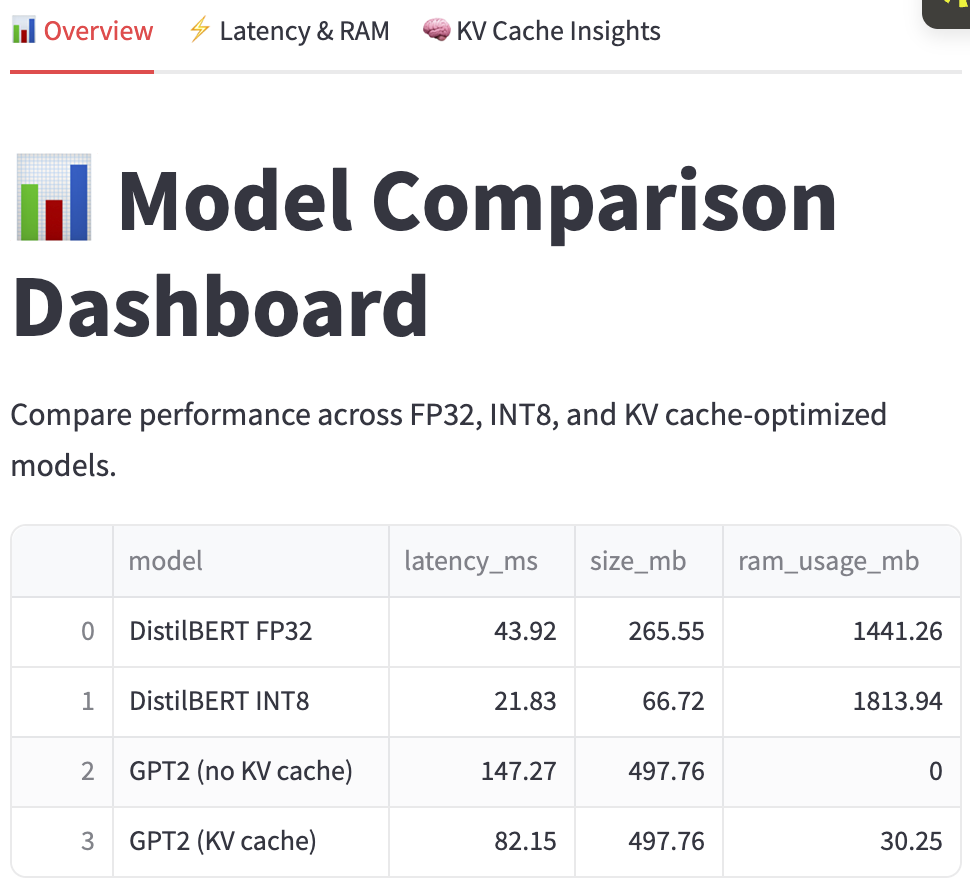

# LLMServeBench



**LLMServeBench** is a benchmarking tool and visualization app designed to evaluate and compare the performance of various Large Language Models (LLMs) for inference workloads. This project helps data scientists and ML engineers analyze model latency, throughput, memory usage, and accuracy metrics across different models and hardware setups.

---

## 🚀 Features

- ✅ Benchmarks multiple LLMs on your own hardware or cloud environments
- 📊 Interactive visualizations using Plotly and Streamlit for easy analysis
- ⚡ Compare model inference speed, memory consumption, and accuracy
- ⚙️ Configurable benchmark parameters
- 🌐 Easy-to-use web app interface for non-technical users

---

## 📺 Demo

Check out the live demo of LLMServeBench on Streamlit Cloud:

👉 [LLMServeBench Live App](https://shivramsriramulu-llmservebench-main-8sxjtb.streamlit.app/)

---

## 📂 GitHub Repository

Explore the full source code and contribute:

👉 [GitHub - ShivramSriramulu/LLMServeBench](https://github.com/ShivramSriramulu/LLMServeBench.git)

---

## 🛠 Installation

1. Clone the repository:

```bash
git clone https://github.com/ShivramSriramulu/LLMServeBench.git
cd LLMServeBench
